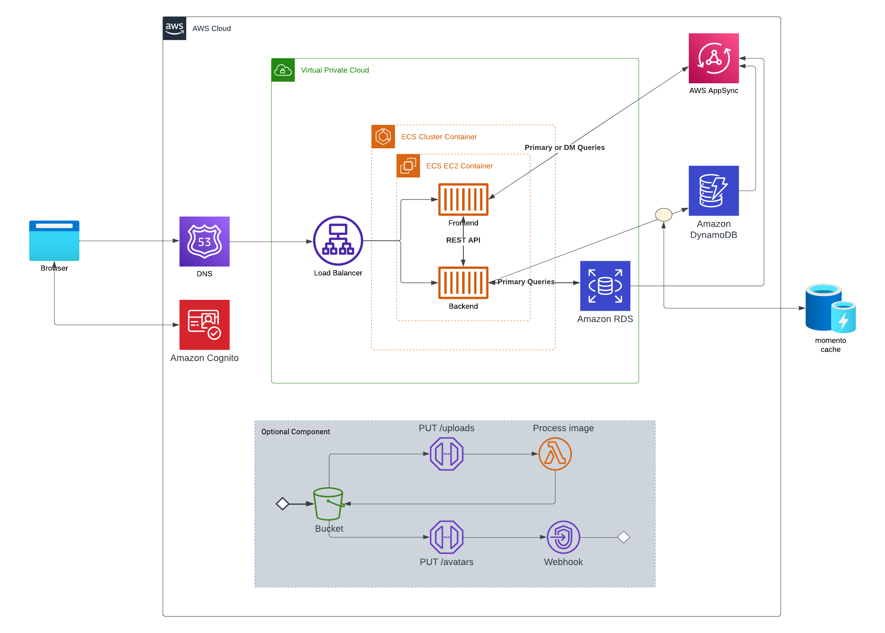
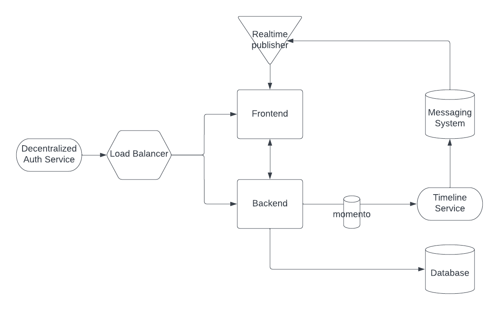

# Week 0 — Billing and Architecture

1. Cruddur Logical Diagram in [LucidCharts](https://lucid.app/lucidchart/5afab1cc-9f2d-46aa-a699-4b233e3034f5/edit?viewport_loc=-1031%2C110%2C4830%2C2415%2C0_0&invitationId=inv_637348e5-c709-448b-8830-07679f9732ef) and exported as PNG: 

1. Cruddur Napkin Diagram in [LucidCharts](https://lucid.app/lucidchart/c8d14a79-74ba-45ae-b659-2884ef198f19/edit?viewport_loc=-15%2C-11%2C2219%2C1005%2C0_0&invitationId=inv_858f1bb1-c54e-415b-b165-2bf76ec7b15d) and exported as PNG:

1. Created a budget
1. Created a billing alarm
1. Generated AWS Credentials
1. Installed AWS CLI in Gitpod
1. Created an Admin User
